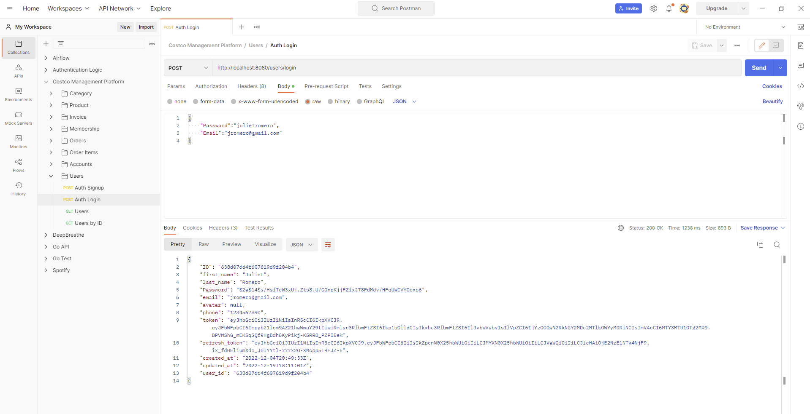

# Costco Management Platform

### Tools: Golang, MongoDB

This backend for a Costco Management Platform was designed using Golang and Mongo DB. It features user authentication using JWT, database access using Mongo DB, and handles HTTP requests, route management, and JSON validation using Gin Gonic.

This CRUD API can keep track of product inventory, orders, invoices, account holders, and their corresponding memberships (Business, Executive, and Gold Star).

 

Account Holder Information:

Memberships:

Products and Categories:

Orders:

Invoices:

 

### Set up

Enter the command `go run main.go` in your terminal.  
Use Postman or an equivalent to send requests to `http://localhost:8080/`.
